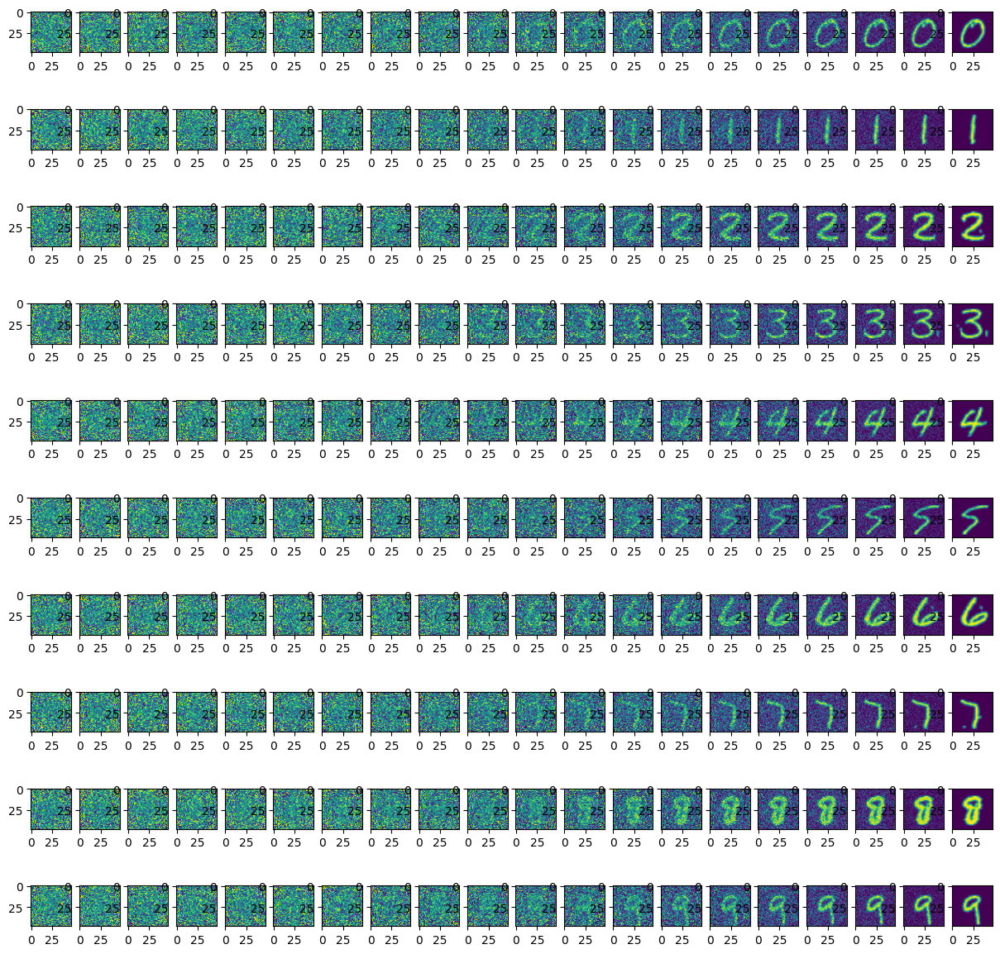

# stable-diffusion

基于mnist手写数字数据集的stable diffusion模型复现

可以输入引导数字，生成对应数字的图片

## 模型效果

引导生成10张图片，分别对应数字0~9



## 训练主模型

```
python train.py
```

## 推理

```
python denoise.py
```

## Lora微调

```
python lora_finetune.py
```